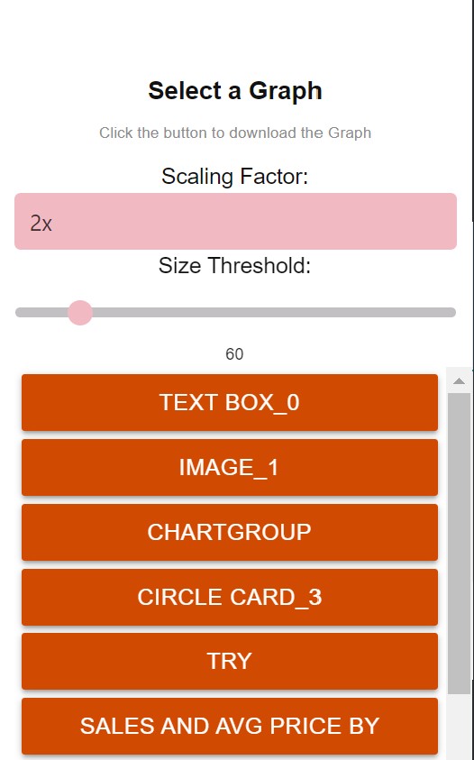

# Transform Exporter Chrome Extension

This Chrome extension allows you to export `.visualContainer` and `.visualContainerGroup` elements from PowerBi reports as images.

## Features

- List and export `.visualContainer` elements individually
- List and export `.visualContainerGroup` elements individually
- Export all visible `.visualContainer` elements at once
- Customize the scaling factor for the exported images
- Highlight the selected element on the PowerBi report

## Installation

1. Clone this repository or download the source code as a ZIP file.
2. Open Google Chrome and navigate to `chrome://extensions`.
3. Enable the "Developer mode" toggle in the top right corner.
4. Click the "Load unpacked" button and select the directory where you downloaded the source code.
5. The extension is now installed and ready to use!

## Usage

1. Click the extension icon in the Chrome toolbar to open the popup.
2. Navigate to the PowerBi report you want to export images from.
3. Choose a scaling factor for the exported images from the dropdown.
4. Click on the listed elements to export them as images, or click the "Export all" button to export all visible elements.
5. The exported images will be downloaded to your default downloads folder.

